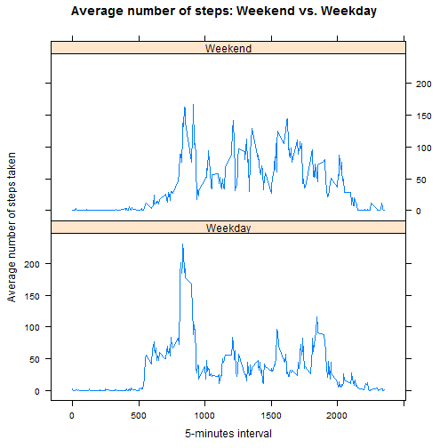

### Data

The data for this assignment can be downloaded from the course web site:

* Dataset: [Activity monitoring data](https://d396qusza40orc.cloudfront.net/repdata%2Fdata%2Factivity.zip) [52K]

The variables included in this dataset are:

* steps: Number of steps taking in a 5-minute interval (missing values are coded as NA)

* date: The date on which the measurement was taken in YYYY-MM-DD format

* interval: Identifier for the 5-minute interval in which measurement was taken

The dataset is stored in a comma-separated-value (CSV) file and there are a total of 17,568 observations in this dataset.


### Loading and preprocessing the data

R-Code download data from [http://d396qusza40orc.cloudfront.net/repdata%2Fdata%2Factivity.zip](http://d396qusza40orc.cloudfront.net/repdata%2Fdata%2Factivity.zip) instead of https to avoid error within Rmd chunk.

The source file repdata-data-activiy.zip is downloaded and unzipped under ./data directory when the file activity.csv is missing. After that, data can be processed within R.


```r
activityData <- read.csv("./data/activity.csv")
```

The number of dataset observations read from file was: ``17568``

First of all, we inspect the format and type of data.


```r
head(activityData)
```

```
##   steps       date interval
## 1    NA 2012-10-01        0
## 2    NA 2012-10-01        5
## 3    NA 2012-10-01       10
## 4    NA 2012-10-01       15
## 5    NA 2012-10-01       20
## 6    NA 2012-10-01       25
```
The dataset includes samples collected with a personal activity monitoring device, that registers the number of steps in 5 minutes intervals through out the day. The activity register contains two months of data (from October to November, 2012) 

### Mean total number of steps taken per day


To compute the daily steps, it is necessary sum all the steps over all the intervals within a day. For this part of the assignment, observations with missing values are ignored. 


```r
dailySteps <- aggregate(formula = steps ~ date, 
                        data = activityData, 
                        FUN = sum, 
                        na.action = na.omit)

head(dailySteps)
```

```
##         date steps
## 1 2012-10-02   126
## 2 2012-10-03 11352
## 3 2012-10-04 12116
## 4 2012-10-05 13294
## 5 2012-10-06 15420
## 6 2012-10-07 11015
```

First part of the asignment shows a histogram of the total number of steps taken each day. 


```r
hist(dailySteps$steps, freq = TRUE, col="#819FF7", border="black",
     xlab = "Steps per day", ylab="Frequency (number of days)", 
     main = "Histogram of the total number of steps per day", 
     axes = TRUE, labels = TRUE,
     breaks = 10, xlim = c(0, 25000), ylim=c(0, 25))
```

 

Now, basic metrics as mean and median are calculated:


```r
mean(dailySteps$steps, na.rm = TRUE)
```

```
## [1] 10766.19
```

```r
median(dailySteps$steps, na.rm = TRUE)
```

```
## [1] 10765
```

### Average daily activity pattern

Now, we are interested in the average daily activity, so we should aggregate the steps using the
interval property as factor and calculate the average of each group. In this case, we do not discard the NA values.


```r
intervalAvgSteps<-aggregate(formula = steps ~ interval, 
                            data = activityData, 
                            FUN = mean)
head(intervalAvgSteps)
```

```
##   interval     steps
## 1        0 1.7169811
## 2        5 0.3396226
## 3       10 0.1320755
## 4       15 0.1509434
## 5       20 0.0754717
## 6       25 2.0943396
```
Now we can plot the data...


```r
plot(intervalAvgSteps, type='l', col="red",
     xlab = "5-minutes interval",
     ylab = "Steps taken averaged across all days", 
     main = "Daily Activity")
```

 

... and determine which is the interval with the maximun number of steps (and this value of steps)


```r
max(intervalAvgSteps$steps)
```

```
## [1] 206.1698
```

```r
intervalAvgSteps[which.max(intervalAvgSteps$steps), 1]
```

```
## [1] 835
```
 
If the first interval corresponds with the time 0:00, the interval 835 will correspond with the 8:35am


### Imputing missing values

There are a number of days/intervals where there are missing values (coded as NA). The presence of missing days may introduce bias into some calculations or summaries of the data. Now, we will calculate and report the total number of missing values in the dataset (i.e. the total number of rows with NAs). It should be advise that NAs values are only present in the steps column, so the number of NAs in this columns will be equal to number of missing values in the dataset.


```r
numNAs <- sum(is.na(activityData$steps))    # same value that sum(is.na(dataActivity))
numNAs
```

```
## [1] 2304
```


Devise a strategy for filling in all of the missing values in the dataset. The strategy does not need to be sophisticated. For example, you could use the mean/median for that day, or the mean for that 5-minute interval, etc.

In this case, we get the indexes of the NAs values in the original data, and use that information to iterate over the
steps property and filling it with the data previously calculated for the average of daily activity. So, the loop creates a new dataset (called activityDataFilled) that is equal to the original dataset but with the missing data filled in.

Make a histogram of the total number of steps taken each day and Calculate and report the mean and median total number of steps taken per day. 


```r
activityDataImputed <- activityData

idxNAs <- which(is.na(activityData$steps))                       # Indexes of the NAs values for steps properties

for (i in idxNAs) {
  intervalValue <- activityDataImputed$interval[i]                # interval with the NA value
  rowIdx <- which(intervalAvgSteps$interval == intervalValue)     # index of the interval within intervalAvgSteps
  activityDataImputed$steps[i] <-intervalAvgSteps$steps[rowIdx]   # newValue of steps = average of that interval
}

dailyStepsImputedNAs <- aggregate(formula = steps ~ date, data = activityDataImputed, FUN = sum)

hist(dailyStepsImputedNAs$steps, col="#819FF7", border="black",
     xlab = "Steps per day", ylab="Frequency (number of days)", 
     main = "Histogram of the total number of steps per day (Imputing missing values)", 
     axes = TRUE, labels = TRUE,
     breaks = 10, xlim = c(0, 25000), ylim=c(0, 25))
```

 


Do these values differ from the estimates from the first part of the assignment? What is the impact of imputing missing data on the estimates of the total daily number of steps? 

First, we can see how the Frequency of days when people walk between 10.000 and 12.000 increses for 16 to 24.

Furthermore, we can recalculate the mean and median values...


```r
mean(dailyStepsImputedNAs$steps)
```

```
## [1] 10766.19
```

```r
median(dailyStepsImputedNAs$steps)
```

```
## [1] 10766.19
```
... where we can see as mean value did not change, and median value increase sightly.


### Differences in activity patterns between weekdays and weekends

First of all, we add a new factor variable with two levels to indicate whether a particular day is either a weekend or a weekday


```r
activityDataImputed$date <- as.Date(activityDataImputed$date)

activityDataImputed$weekend <- weekdays(activityDataImputed$date) %in% c("sábado", "domingo")
activityDataImputed$weekend <- factor(activityDataImputed$weekend, levels = c(F, T), labels = c("Weekday", "Weekend"))

str(activityDataImputed)
```

```
## 'data.frame':	17568 obs. of  4 variables:
##  $ steps   : num  1.717 0.3396 0.1321 0.1509 0.0755 ...
##  $ date    : Date, format: "2012-10-01" "2012-10-01" ...
##  $ interval: int  0 5 10 15 20 25 30 35 40 45 ...
##  $ weekend : Factor w/ 2 levels "Weekday","Weekend": 1 1 1 1 1 1 1 1 1 1 ...
```
With that information, we can make a panel plot containing a time series plot of the 5-minute interval (x-axis) and the average number of steps taken, averaged across all weekday days or weekend days (y-axis). 


```r
weekdayIntervalSteps <- aggregate(
     formula = steps ~ weekend + interval,
     data = activityDataImputed,
     FUN = mean
 )
 
library("lattice")

xyplot(x = steps ~ interval | weekend,   
      data = weekdayIntervalSteps,
      type = "l", layout=c(1,2), 
      xlab="5-minutes interval", ylab="Average number of steps taken",
      main = "Average number of steps: Weekend vs. Weekday" 
 )
```

 

- Analyzing the graphics may draw the following aspects related with the activity period (in terms of the steps taken):

    - Activity period begins earlier during weekdays (People often sleep more during the weekend ;)
    - Period of highest activity is reached weekdays in the range 8:30-9:00, coincident time of entry into many jobs.
    - Period of activity in the central hours (10:00 to 19:00) is much lower during weekdays. 
         - Once again, it coincides with working hours in most places.
    - Decrease of daily activity occurs at a later time during the weekends
