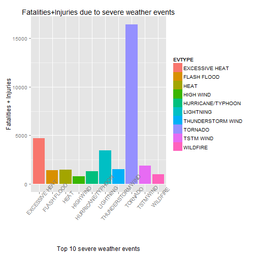
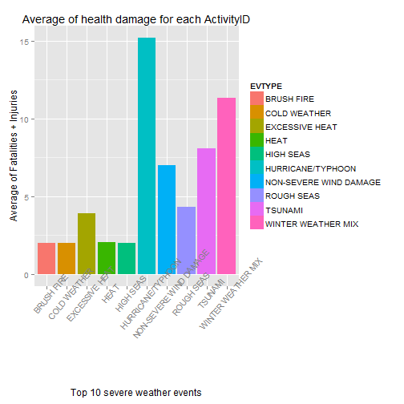
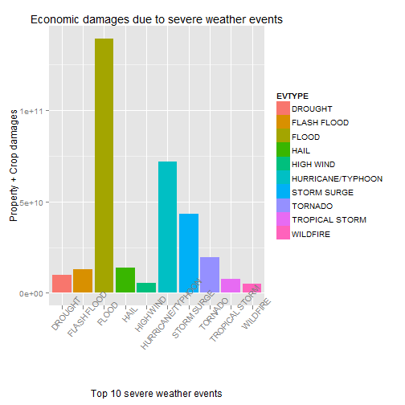

# NOAA Storm Database: studying the impact of severe weather events
### Reproducible Research Course: Course Project 

---

## Synopsis

This report analyses the data from the National Climatic Data Center Storm Events to address their impact in two main aspects:

- what events are more related with respect to population health? To answer this question, the measures studied were the Fatalities and Injuries. 

- what events are more related with the greatest economic consequences? In this case, the report focus on the damages over properties and crops to answer it.

In both cases only the data collected since 2000 is analysed in the study, as it is considered that the relatively more recent (instead of historical data) are most relevant for decision-making by the authorities.

## Introduction

Storms and other severe weather events can cause both public health and economic problems for communities and municipalities. Many severe events can result in fatalities, injuries, and property damage, and preventing such outcomes to the extent possible is a key concern.

This project involves exploring the U.S. National Oceanic and Atmospheric Administration's (NOAA) storm database. This database tracks characteristics of major storms and weather events in the United States, including when and where they occur, as well as estimates of any fatalities, injuries, and property damage.

---

## Data Description

The data for this assignment come in the form of a comma-separated-value file compressed via the bzip2 algorithm to reduce its size. You can download the file from the course web site:

 - [Storm Data](https://d396qusza40orc.cloudfront.net/repdata%2Fdata%2FStormData.csv.bz2) [47Mb]

There is also some documentation of the database available. Here you will find how some of the variables are constructed/defined.

 - National Weather Service Storm Data Documentation

 - National Climatic Data Center Storm Events [FAQ](https://d396qusza40orc.cloudfront.net/repdata%2Fpeer2_doc%2FNCDC%20Storm%20Events-FAQ%20Page.pdf)

The events in the database start in the year 1950 and end in November 2011. In the earlier years of the database there are generally fewer events recorded, most likely due to a lack of good records. More recent years should be considered more complete. 

---

## Data Processing


### Download and load data


```r
## Load required packages
library(ggplot2)
```


```r
## Create directory for downloaded data. If this dir does not exist, data will
## be downloaded, else we will assume the data is already available.
if(!file.exists("data")) {
  dir.create("data")
  
  url <- "https://d396qusza40orc.cloudfront.net/repdata%2Fdata%2FStormData.csv.bz2"
  download.file(url, "./data/noaa.storm.data.csv.bz2") 
  downloadedTime <- Sys.time()
}

# Loading the data
initial <- read.csv("./data/noaa.storm.data.csv.bz2", nrows = 5)
                    
classes <- sapply(initial, class)
classes[c("BGN_DATE", "BGN_TIME", "EVTYPE", "F")] <- "character"
classes <- ifelse(classes == "logical", "character", classes)

noaa <- read.csv("./data/noaa.storm.data.csv.bz2", colClasses = classes,
                 na.strings="")

noaa$EVTYPE <- as.factor(noaa$EVTYPE)

noaa$BGN_DATE <- as.POSIXlt(noaa$BGN_DATE, format = "%m/%d/%Y %H:%M:%S")
```
The current report should be used by the manager who might be responsible for preparing for severe weather events, so he/she will need to prioritize resources for different types of events. 

For that reason **we will only consider the data since 2000**, since this manager will be more interested in current information to proceed with their improvement rather than on the historical evolution. Of course, in a real case, this approach should be adjusted and agreed with the manager.

This also avoids the fact that, in the earlier years of the database there are generally fewer events recorded due to a minor existence of good records.

For practical purposes, this approach will reduce the time needed for the analysis.


```r
nrow(noaa)                                                            # original observations
```

```
## [1] 902297
```

```r
noaa <- noaa[as.numeric(format(noaa$BGN_DATE, "%Y")) >= 2000, ]       # discarding data before year 2000

nrow(noaa)                                                            # data considered into the report
```

```
## [1] 523163
```

### A brief overview

First we make a preliminary study over the data. This information will allow us 
to determine which of the variables are more relevant to perform the study


```r
dim(noaa)                                   # get dimensions: observations and features/variables
```

```
## [1] 523163     37
```

```r
str(noaa)                                   # feature/variable names and info
```

```
## 'data.frame':	523163 obs. of  37 variables:
##  $ STATE__   : num  1 1 1 1 1 1 1 1 1 1 ...
##  $ BGN_DATE  : POSIXlt, format: "2000-02-13" "2000-02-13" ...
##  $ BGN_TIME  : chr  "06:09:00 PM" "06:15:00 PM" "06:24:00 PM" "06:35:00 PM" ...
##  $ TIME_ZONE : Factor w/ 22 levels "ADT","AKS","AST",..: 7 7 7 7 7 7 7 7 7 7 ...
##  $ COUNTY    : num  77 77 33 75 93 133 133 127 79 83 ...
##  $ COUNTYNAME: Factor w/ 29600 levels "5NM E OF MACKINAC BRIDGE TO PRESQUE ISLE LT MI",..: 10093 10093 2928 10073 10613 27721 27721 27228 10097 10401 ...
##  $ STATE     : Factor w/ 72 levels "AK","AL","AM",..: 2 2 2 2 2 2 2 2 2 2 ...
##  $ EVTYPE    : Factor w/ 985 levels "   HIGH SURF ADVISORY",..: 856 856 856 856 856 244 856 856 856 856 ...
##  $ BGN_RANGE : num  0 0 0 0 0 0 0 0 0 0 ...
##  $ BGN_AZI   : chr  NA NA NA NA ...
##  $ BGN_LOCATI: chr  "KILLEN" "ROGERSVILLE" "SHEFFIELD" "VERNON" ...
##  $ END_DATE  : chr  "2/13/2000 0:00:00" "2/13/2000 0:00:00" "2/13/2000 0:00:00" "2/13/2000 0:00:00" ...
##  $ END_TIME  : chr  "06:09:00 PM" "06:15:00 PM" "06:24:00 PM" "06:35:00 PM" ...
##  $ COUNTY_END: num  0 0 0 0 0 0 0 0 0 0 ...
##  $ COUNTYENDN: chr  NA NA NA NA ...
##  $ END_RANGE : num  0 0 0 0 0 0 0 0 0 0 ...
##  $ END_AZI   : chr  NA NA NA NA ...
##  $ END_LOCATI: chr  "KILLEN" "ROGERSVILLE" "SHEFFIELD" "VERNON" ...
##  $ LENGTH    : num  0 0 0 0 0 0 0 0 0 0 ...
##  $ WIDTH     : num  0 0 0 0 0 0 0 0 0 0 ...
##  $ F         : chr  NA NA NA NA ...
##  $ MAG       : num  55 55 60 60 55 275 60 60 60 55 ...
##  $ FATALITIES: num  0 0 0 0 0 0 0 0 0 0 ...
##  $ INJURIES  : num  0 0 0 0 0 0 0 0 0 0 ...
##  $ PROPDMG   : num  20 20 2 5 2 5 4 30 20 25 ...
##  $ PROPDMGEXP: Factor w/ 18 levels "-","?","+","0",..: 16 16 16 16 16 16 16 16 16 16 ...
##  $ CROPDMG   : num  0 0 0 0 0 0 0 0 0 0 ...
##  $ CROPDMGEXP: chr  "K" "K" "K" "K" ...
##  $ WFO       : chr  "BMX" "BMX" "BMX" "BMX" ...
##  $ STATEOFFIC: chr  "ALABAMA, Central" "ALABAMA, Central" "ALABAMA, Central" "ALABAMA, Central" ...
##  $ ZONENAMES : chr  NA NA NA NA ...
##  $ LATITUDE  : num  3452 3450 3446 3345 3401 ...
##  $ LONGITUDE : num  8732 8717 8742 8807 8746 ...
##  $ LATITUDE_E: num  3452 3450 3446 3345 3401 ...
##  $ LONGITUDE_: num  8732 8717 8742 8807 8746 ...
##  $ REMARKS   : chr  "Numerous trees and power lines were blown down near Killen.\n" "Numerous trees and power lines were knocked down in the Rogersville area.\n" "Several trees were blown down in Sheffield\n" "Trees were blown down in and around the city of Vernon.\n" ...
##  $ REFNUM    : num  379210 379211 379212 379213 379214 ...
```

```r
sum(!is.na(unique(noaa$EVTYPE)))            # number of different health events
```

```
## [1] 196
```

### Health damages


#### Extracting relevant features


we will considered the data related with the fatalities and the injuries as the most relevant measures within the health aspects.


```r
healthFeatures <- c("EVTYPE", "FATALITIES", "INJURIES")
noaaHealth <- noaa[, healthFeatures]                       # tidy data.frame
```

### Economic damage


#### Extracting relevant features


we will considered the data related with the features 'PROPDMG' (Property damage) and 'CROPDMG' (Crop Damage) as the most relevant measures within the health aspects. 'PROPDMGEXP' and 'CROPDMGEXP' features are also select because the references the unit of the measures. This expressions should be pre-processed to transform (h) hundred, (k) thousand, (M) millions or (B) billions expressions to numerical values valid for a mathematical analysis.

Data with invalid observations will be discarded in the analysis (factorValue will be 0)


```r
economicFeatures <- c("EVTYPE", "PROPDMG", "PROPDMGEXP", "CROPDMG", "CROPDMGEXP")
noaaEconomic <- noaa[, economicFeatures]                        # tidy data.frame           

noaaEconomic$PROPDMGEXP <- toupper(noaaEconomic$PROPDMGEXP)
noaaEconomic$CROPDMGEXP <- toupper(noaaEconomic$CROPDMGEXP)

# PROPDMGEXP and CROPDMGEXP will be replaced with the magnitude order for the correspondence units
# Within transformations there are commented lines because in the subset there are no data with this label and the
# execution will originate an exception. If the dataset considered changes, this transformations must be revised to
# avoid errors on the results"

noaaEconomic[!noaaEconomic$PROPDMGEXP %in% c("H", "K", "M", "B"), ]$PROPDMGEXP = 0  # remove levels out-of-range expected
# noaaEconomic[noaaEconomic$PROPDMGEXP == "H", ]$PROPDMGEXP = 2                # hundred
noaaEconomic[noaaEconomic$PROPDMGEXP == "K", ]$PROPDMGEXP = 3                  # thousand 
noaaEconomic[noaaEconomic$PROPDMGEXP == "M", ]$PROPDMGEXP = 6                  # million 
noaaEconomic[noaaEconomic$PROPDMGEXP == "B", ]$PROPDMGEXP = 9                  # billion 

noaaEconomic[!noaaEconomic$CROPDMGEXP %in% c("H", "K", "M", "B"), ]$CROPDMGEXP = 0  # remove levels out-of-range expected
#noaaEconomic[noaaEconomic$CROPDMGEXP == "H", ]$CROPDMGEXP = 2                 # hundred 
noaaEconomic[noaaEconomic$CROPDMGEXP == "K", ]$CROPDMGEXP = 3                  # thousand
noaaEconomic[noaaEconomic$CROPDMGEXP == "M", ]$CROPDMGEXP = 6                  # million 
noaaEconomic[noaaEconomic$CROPDMGEXP == "B", ]$CROPDMGEXP = 9                 # billion 


# Create 2 new numerial properties in noaaEconomic data.frame with the adjusted value for the economic damage
noaaEconomic$adjustedPROPDMG <- noaaEconomic$PROPDMG * 10^as.numeric(noaaEconomic$PROPDMGEXP)
noaaEconomic$adjustedCROPDMG <- noaaEconomic$CROPDMG * 10^as.numeric(noaaEconomic$CROPDMGEXP)
```


---

### Results


#### Health Damage


We should aggregate data using the EventID as factor, and taking into account the sum of fatalities and injuries as indicator of the health damage caused for the severe weather events. 


```r
# aggregate each one of the health related features over the type of event

healthSumDamage <- aggregate(formula = (FATALITIES + INJURIES)  ~ EVTYPE, 
                             data = noaaHealth,
                             FUN = sum, 
                             na.action = na.omit)

names(healthSumDamage) <- c("EVTYPE", "TotalHealthDamage")

# Extract the ten weather events with more related fatalities+injuries 
healthSumDamage_topTen <- head( healthSumDamage[order(-healthSumDamage$TotalHealthDamage), ], 10 )
healthSumDamage_topTen
```

```
##                EVTYPE TotalHealthDamage
## 152           TORNADO             16406
## 36     EXCESSIVE HEAT              4721
## 93          LIGHTNING              3459
## 156         TSTM WIND              1869
## 148 THUNDERSTORM WIND              1530
## 67               HEAT              1453
## 45        FLASH FLOOD              1412
## 80  HURRICANE/TYPHOON              1339
## 185          WILDFIRE               986
## 78          HIGH WIND               808
```

This information is also represented in a graphical way, where you can check that *tornado* is the event that produces
the higher number of incidences over the health measures taking into account all the events from 2000.


```r
q1 <- qplot(EVTYPE, TotalHealthDamage, data=healthSumDamage_topTen, geom="bar", stat="identity", fill=EVTYPE,
            main = "Fatalities+Injuries due to severe weather events",
            xlab = "Top 10 severe weather events", ylab = "Fatalities + Injuries") 
q1 + theme(axis.text.x = element_text(angle=50))
```

 

The total number of health damages (as fatalities+injuries) gives an aggregate information without data about the number of events that produced that numbers. So, we perform a new aggregation using the average as function applied to the data.


```r
# aggregate each one of the health related features over the type of event

healthAvgDamage <- aggregate(formula = (FATALITIES + INJURIES) ~ EVTYPE, 
                               data = noaaHealth,
                               FUN = mean, 
                               na.action = na.omit)

names(healthAvgDamage) <- c("EVTYPE", "TotalHealthDamage")

# Extract the ten weather events with more related fatalities+injuries 
healthAvgDamage_topTen <- head( healthAvgDamage[order(-healthAvgDamage$TotalHealthDamage), ], 10 )
healthAvgDamage_topTen
```

```
##                     EVTYPE TotalHealthDamage
## 80       HURRICANE/TYPHOON         15.215909
## 193     WINTER WEATHER MIX         11.333333
## 161                TSUNAMI          8.100000
## 105 NON-SEVERE WIND DAMAGE          7.000000
## 126             ROUGH SEAS          4.333333
## 36          EXCESSIVE HEAT          3.924356
## 67                    HEAT          2.043601
## 15              BRUSH FIRE          2.000000
## 19            COLD WEATHER          2.000000
## 73               HIGH SEAS          2.000000
```

The following plot shows how the *Hurricane/Typhoon* is the event that produces a higher number of fatalities or injuries for each individual occurrence (more than 30)


```r
q2 <- qplot(EVTYPE, TotalHealthDamage, data=healthAvgDamage_topTen, geom="bar", stat="identity", fill=EVTYPE,
            main = "Average of health damage for each ActivityID",
            xlab = "Top 10 severe weather events", ylab = "Average of Fatalities + Injuries") 
q2 + theme(axis.text.x = element_text(angle=50))
```

 


### Economic damage


As in the previous case, we should aggregate data using the EventID as factor, and taking into account the sum of Property and Crop damages as indicator of the health damage caused for the severe weather events. 


```r
# aggregate each one of the health related features over the type of event

economicDamage <- aggregate(formula = (adjustedPROPDMG + adjustedCROPDMG)  ~ EVTYPE, 
                            data = noaaEconomic,
                            FUN = sum, 
                            na.action = na.omit)

names(economicDamage) <- c("EVTYPE", "TotalEconomicDamage")

# Extract the ten weather events with more related adjustedPROPDMG + adjustedCROPDMG
economicDamage_topTen <- head( economicDamage[order(-economicDamage$TotalEconomicDamage), ], 10 )
economicDamage_topTen
```

```
##                EVTYPE TotalEconomicDamage
## 46              FLOOD        138913008480
## 80  HURRICANE/TYPHOON         71913712800
## 143       STORM SURGE         43170935000
## 152           TORNADO         19695553070
## 64               HAIL         13773372120
## 45        FLASH FLOOD         12781493610
## 26            DROUGHT          9982231000
## 155    TROPICAL STORM          7607241550
## 78          HIGH WIND          5443578420
## 185          WILDFIRE          5054139800
```

The following plot shows how the *Flood* and the *Hurricane/Thyphoon* are the events that produce a higher economic impact in the properties and crops from year 2000. Events like *Storm Surge* and *Tornado* are also present in the first positions of this ranking 


```r
q3 <- qplot(EVTYPE, TotalEconomicDamage, data=economicDamage_topTen, geom="bar", stat="identity", fill=EVTYPE,
            main = "Economic damages due to severe weather events",
            xlab = "Top 10 severe weather events", ylab = "Property + Crop damages") 
q3 + theme(axis.text.x = element_text(angle=50))
```

 

Here, we can observe the proportion over the total economic damage produced by the top ten severe weather events studied (and form the 4 previously named)


```r
# Percentage of economic damage explained for the top ten severe weather events
sum(economicDamage_topTen$TotalEconomicDamage) / sum(economicDamage$TotalEconomicDamage)
```

```
## [1] 0.9264699
```

```r
# Percentage of economic damage explained for the top four severe weather events
sum(economicDamage_topTen$TotalEconomicDamage[1:4]) / sum(economicDamage$TotalEconomicDamage)
```

```
## [1] 0.7722854
```

---

### Conclusions

The following conclusions can be derived from the two main questions that this data analysis address:  

#### Health damages

1. Which type of events are (as indicated in the `EVTYPE` variable) are most harmful with respect the population health

An in depth analysis of the data related with the impact of severe weather conditions over the health measures studied in this report produces the following aspects:

-- The *Tornado* evens are the events that produces the higher impact over population health measures (fatalities + injuries) from 2000 : 1.6406 &times; 10<sup>4</sup>

-- The *Tornado* events produce in average  0.9275739 fatalities + injuries from 2000. This small value may indicate a high number of events without health impact (low intensity, location on unpopulated areas...)

-- The *Hurricane/Typhoon* is the event that produces a higher number of fatalities or injuries for each individual occurrence. Taking into account all the *Hurricane/Typhoon* events the total number of impacts over health measures are 1339


#### Economic damages

2. Which type of events have the greatest economic consequences?

An in depth analysis of the data related with the impact of severe weather conditions over the economic measures studied in this report produces the following aspects:

-- The *Flood* events are responsible for most economic damage due severe weather conditions (economicDamage_topTen[1,2] USA dollars )

-- Several events that greatly affect the economic damage are appreciated (*Flood, Hurricane/Typhoon, Tornado and Storm Surge*), making it more difficult to focus on only one of them


