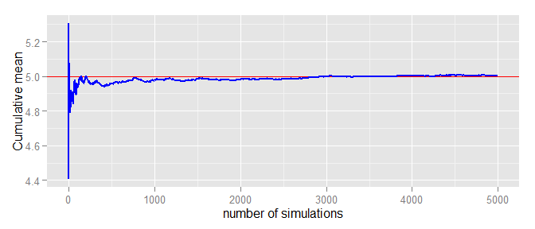
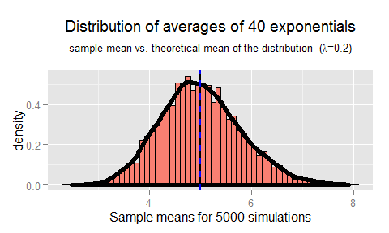
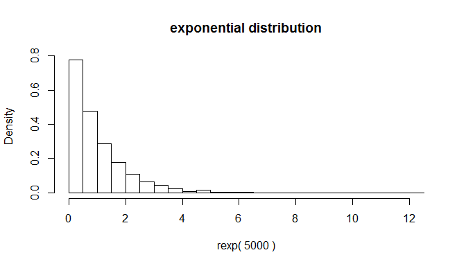
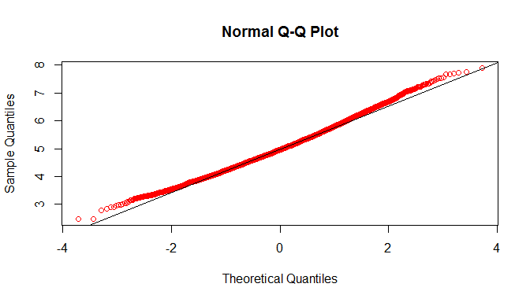

# Statistical Inference: simulation

#Statistical Inference: Simulation project
### (c) Marcos Gestal. March 2015.

----

## Overview

This project investigates the exponential distribution in R and compare it with the Central Limit Theorem. 

The exponential distribution can be simulated in R with `rexp(n, lambda)` where lambda is the rate parameter. The mean of exponential distribution is 1/lambda and the standard deviation is also 1/lambda. Set ***lambda = 0.2*** for all of the simulations. The project will investigate the distribution of averages of 40 exponentials and illustrates via simulation and associated explanatory text the properties of the distribution of the mean of 40 exponentials. 

## Simulations

First of all, data for simulation should be generated. The simulation data will be stored in a matrix of 
dimensions (nSimulations x nDistributions), so each row correspond with an individual simulation, that is, nDistribution numbers from an exponential function that after will be averaged to check the normality of the distribution of the mean of *n* exponential distributions.


```r
nDistributions <- 40;
nSimulations <- 5000;
lambda <- 0.2;

set.seed(1234)

simulationValues <- rexp( nSimulations * nDistributions, lambda )
simulationMatrix <- matrix(simulationValues, nSimulations, nDistributions)
```

### Sample vs. theoretical mean of the distribution.

The theoretical mean is $$ \mu = \frac{1}{lambda} $$ and the sample mean is a random variable that should be centered
around the same value.


```r
theoreticalMean <- 1/lambda

# Simulation mean: each position is the mean of nDistribution random values 
#                  (from an exponential distribution). Length: nSimulatinons
simulationMean <- rowMeans(simulationMatrix);                                                 
sampleMean <- mean(simulationMean)
```


```
## [1] "Theoretical mean: 5.000000"
```

```
## [1] "Sample mean: 5.003888"
```

Next figure uses de law of large number to demonstrate how the sample mean tends to the theoretical mean as the number of simulations increase. 



### Sample vs. theoretical variance of the distribution


Standard deviation for an exponencial distribution is $$ S = {\frac{1}{\lambda}}  $$ 

and talks about how variable the population is. So, the variance of the sample mean should be estimated with  $$ {\frac{S^2}{n}}  $$ where n is the number of distributions. This variance will show us how variable averages of random samples of size *n* from the population are.


```r
theoreticalVariance <- ((1/lambda)^2)/nDistributions  # Theoretical Variance
sampleVariance<- var(simulationMean)
```


```
## [1] "Sample variance: 0.625956"
```

```
## [1] "Theoretical variance: 0.625000"
```

As in the previous point, the sample variance and the population variance are very similar. Note as if we increase the number of distributions, we would reduce the variance of the distribution of averages.

### Comparing the distribution with a normal

We can argue several facts that evidence that distribution of averages is close to a normal distribution:

Firstly it should be noted in the next figure that the distribution of averages is very similar to a Gaussian distribution. Here, the histogram shows the sample distribution of the mean of 40 exponentials and overlaps the distribution function of the samples. It is very different from the distribution of an individual exponential distribution (see Appendix 2). Also, this figure shows how the sample mean (blue) and the theoretical mean (black) are very close.




Another fact that points to the normality of the distribution is related with the percentiles. In a normal distribution 68%, 95% and 99% of the density lies within the 1, 2 and 3 standad deviations from the mean. In our distribution this theoretical values will correspond with:


```r
theoreticalMean + c(1, 2, 3)*theoreticalVariance
```

```
## [1] 5.625 6.250 6.875
```
If we obtain this percentiles from the sample, it should be very similar to the previous ones, as we can check as follow


```r
quantile(simulationMean, c(0.68, 0.95, 0.99))
```

```
##      68%      95%      99% 
## 5.338083 6.382068 7.047038
```

But the best way to check if a distribution is similar to a normal distribution is using a Quantile-Quantile plot. In this kind of plot, each point represent the sample value vs the theoretical value, so if the distribution is normal all the points should be located over a 45 degrees line. Following the generated graph in Appendix 3, we can conclude that the distribution of averages of 40 exponentials is very close to a normal distribution.


## Conclusion

In probability theory, the Central Limit Theorem states that, given certain conditions, the arithmetic mean of a sufficiently large number of iterates of independent random variables, each with a well-defined expected value and well-defined variance, will be approximately normally distributed, regardless of the underlying distribution (an exponential distribution in this experiment)

The performed simulation confirms this hypothesis because the distribution of the mean of 40 exponentials is really close to a normal distribution.

\newpage


## Appendix 1 - R code for figure 1

```r
library(ggplot2)

g <- ggplot(data = data.frame(simulationMean), aes(x=simulationMean))

g <- g + geom_histogram(fill = "salmon", binwidth=0.1, 
                        aes(y=..density..), color="black")
g <- g + geom_density(size = 2)

g <- g + geom_vline(xintercept = theoreticalMean, size = 1, color = "black", 
                    linetype=1)
                    
g <- g + geom_vline(xintercept = sampleMean, size = 1, color = "blue", 
                    linetype=2)

g <- g + ggtitle(bquote(atop(paste("Distribution of averages of ", .(nDistributions), 
                                   " exponentials"),
                        atop(paste("sample mean vs. theoretical mean of the distribution (", 
                                   lambda, "=", .(lambda), ")")))))

g <- g + xlab(paste("Sample means for", nSimulations, "simulations"))

```

## Appendix 2 - Exponential Distribution


 

## Appendix 3 - Normal Quantile-Quantile Plot


```r
qqnorm(simulationMean, col="red")
qqline(simulationMean)
```

 

