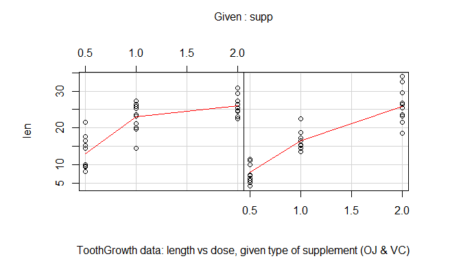
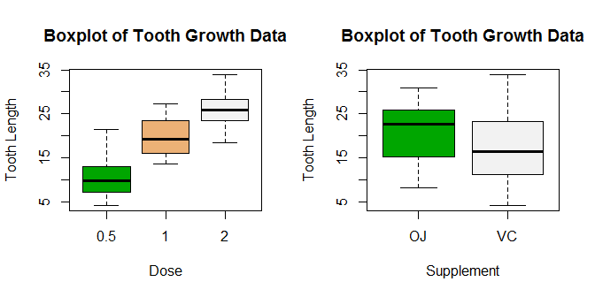

# Statistical Inference: inference

#Statistical Inference: Inference project
### (c) Marcos Gestal. March 2015.

----

## Overview

This second part of the project will analyze the ToothGrowth data in the R datasets package and provide some conclusions about the growth by supp and dose.

## Analysis

### Load data and basic exploratory data analyses


ToothBrowth data represents the length of odontoblasts (teeth) in each of 10 guinea pigs at each of three dose levels of Vitamin C (0.5, 1, and 2 mg) with each of two delivery methods (orange juice or ascorbic acid). We can reasonably assume that the total number of different individuals in the population is 60 (1 pig for each combination of delivery method and dose). We are also assuming that the pigs were randomly chosen so the population variance is the same for all subsets.


```r
data(ToothGrowth)   # loading data
str(ToothGrowth)
```

```
## 'data.frame':	60 obs. of  3 variables:
##  $ len : num  4.2 11.5 7.3 5.8 6.4 10 11.2 11.2 5.2 7 ...
##  $ supp: Factor w/ 2 levels "OJ","VC": 2 2 2 2 2 2 2 2 2 2 ...
##  $ dose: num  0.5 0.5 0.5 0.5 0.5 0.5 0.5 0.5 0.5 0.5 ...
```
See appendix 1 for a graphical view of the data with supplement and dose influeces.


### Provide a basic summary of the data


```r
summary(ToothGrowth)
```

```
##       len        supp         dose      
##  Min.   : 4.20   OJ:30   Min.   :0.500  
##  1st Qu.:13.07   VC:30   1st Qu.:0.500  
##  Median :19.25           Median :1.000  
##  Mean   :18.81           Mean   :1.167  
##  3rd Qu.:25.27           3rd Qu.:2.000  
##  Max.   :33.90           Max.   :2.000
```

```r
aggregate(data = ToothGrowth, len ~ supp * dose , mean)
```

```
##   supp dose   len
## 1   OJ  0.5 13.23
## 2   VC  0.5  7.98
## 3   OJ  1.0 22.70
## 4   VC  1.0 16.77
## 5   OJ  2.0 26.06
## 6   VC  2.0 26.14
```

```r
table(ToothGrowth$dose, ToothGrowth$supp)
```

```
##      
##       OJ VC
##   0.5 10 10
##   1   10 10
##   2   10 10
```

The two supplement methods (with 3 different doses) are applied to the 10 pigs in an independent way, so the next tests will use an unpaired approximation when it will be required.

Appendix 2 shows a boxplot of the data where the mean and variance per dose and per supplement can be graphically checked. As the boxplot shows, the lenght increases as the dose also increases from 0,5 to 2mg. The influence of the delivery methods (Oranje Juice; Ascorbid Acid) is not so clear in this graph but it seems that Orange Juice has a better performance, so some tests will be required.

## Statistical Inference


### Influence of the Supplement type over the length increase

Firstly, we will compare the influence of the supplement type without taking into account the dose.


```r
suppOJ <- ToothGrowth[which(ToothGrowth$supp=="OJ"), ]
suppVC <- ToothGrowth[which(ToothGrowth$supp=="VC"), ]  
```

Appendix 3 shows the Confidence Interval obtained with the Wald method for the mean of the difference of length by the supplement used. However, the number of samples is small, so in advance T Test will be prefered. In this test, the Null Hypothesis will be that "There are NO differences between the effect of delivery method (orange juice or ascorbic acid)".


```r
t.test(suppVC$len, suppOJ$len, paired = F)
```

```
## 
## 	Welch Two Sample t-test
## 
## data:  suppVC$len and suppOJ$len
## t = -1.9153, df = 55.309, p-value = 0.06063
## alternative hypothesis: true difference in means is not equal to 0
## 95 percent confidence interval:
##  -7.5710156  0.1710156
## sample estimates:
## mean of x mean of y 
##  16.96333  20.66333
```

Since the p-value is 0.06063 (p-value >  0.05) null hypothesis can not be rejected, so we accept that *there are NOT differences due to delivery method*. The difference between p-value and $\alpha$ is really small so there is a weak evidence in favor of the null hypothesis, therefore more tests will be performed.

[If we considered paired data (the different supplements and dose are applied only in 10 pigs) we should applied a paired test. In this case the p-value would be 0.00255 (p-value <  0.05) and the null hypothesis can be reject, so we would accept that **there are differences due to delivery method**. Furthermore, in this case the estimated mean would be -3.7, so the best supplement seems to be the Orange Juice]

### Influence of the Supplement type over the length increase (by dose)

Once we stated it seems that there is not a significant different between the supplements, we will test the influence of the supplement type depending on the dose value


```r
dose05_suppOJ <- suppOJ[(suppOJ$dose==0.5), ]
dose05_suppVC <- suppVC[(suppVC$dose==0.5), ]

t.test(dose05_suppVC$len, dose05_suppOJ$len, paired = F)    
```

```
## 
## 	Welch Two Sample t-test
## 
## data:  dose05_suppVC$len and dose05_suppOJ$len
## t = -3.1697, df = 14.969, p-value = 0.006359
## alternative hypothesis: true difference in means is not equal to 0
## 95 percent confidence interval:
##  -8.780943 -1.719057
## sample estimates:
## mean of x mean of y 
##      7.98     13.23
```

```r
dose1_suppOJ <- suppOJ[(suppOJ$dose==1), ]
dose1_suppVC <- suppVC[(suppVC$dose==1), ]

t.test(dose1_suppVC$len, dose1_suppOJ$len, paired = F)   
```

```
## 
## 	Welch Two Sample t-test
## 
## data:  dose1_suppVC$len and dose1_suppOJ$len
## t = -4.0328, df = 15.358, p-value = 0.001038
## alternative hypothesis: true difference in means is not equal to 0
## 95 percent confidence interval:
##  -9.057852 -2.802148
## sample estimates:
## mean of x mean of y 
##     16.77     22.70
```

```r
dose2_suppOJ <- suppOJ[(suppOJ$dose==2), ]
dose2_suppVC <- suppVC[(suppVC$dose==2), ]

t.test(dose2_suppVC$len, dose2_suppOJ$len, paired = F)   
```

```
## 
## 	Welch Two Sample t-test
## 
## data:  dose2_suppVC$len and dose2_suppOJ$len
## t = 0.0461, df = 14.04, p-value = 0.9639
## alternative hypothesis: true difference in means is not equal to 0
## 95 percent confidence interval:
##  -3.63807  3.79807
## sample estimates:
## mean of x mean of y 
##     26.14     26.06
```

According with these p-values the two supplement methods are different with a 0.5mg and 1mg doses (best performance for Orange Juice) and equal with 2mg doses (with a very strong evidence at this point)


## Conclusion

Confidence interval and hypothesis testing was performed (confidence interval for normal distribution using CLT assumptions was showed in Appendix 3 only with educational and comparision purposes). The ToothGrowth dataset was 60 individuals. Each one of that pigs were used to test the different supplement types and the different doses for each one, so not paired tests (independent groups) were used (results are very similar without this assumption).

From these tests, the following clonclusions can be extrated:

* The boxplot and scatterplot show how a increase of the dose implies an increase of the length for both supplements
* If doses values are ignored, there are not statistically significant differences between the type of supplement 
* If doses values are considered, according Confidence Intervals, for 0.5mg and 1mg doses the best supplement is the Orange Juice. For 2mg doses, both methods achieve very similar results.

\newpage


## Appendix 1 : ToothGrowth data


 

## Appendix 2 : Boxplot 




## Appendix 3 : Wald approach to confidence interval for the mean of length   

The variable difLength contains the differences in toothgrowth related with the supplement (a positive value means that VC/Ascorbic Acid offers a higher increase than Orange Juice). The Central Limit Theorem states that the averages are approximately normal centered at the population mean and with standar deviation equal to the standard error of the mean.


```r
difLength <- suppVC$len - suppOJ$len
mean(difLength)
```

```
## [1] -3.7
```

```r
mean(difLength)+c(-1,1)*qnorm(.975)*sd(difLength)/sqrt(length(difLength))  
```

```
## [1] -5.895815 -1.504185
```

This test give us an interval where 0 is not included, so we can conclude that there is difference between the supplments. Furthermore, mean is -3.7 and the confidence interval is between negative numbers so Orange Juice is considered better than Ascorbic Acid.

However this test presents a huge problem: Central Limit Theorem gives not guarantee that the amount of data is large anough and, in this particular case, the amount of data is really very low (only 10 values for each combination of supplement and dose; 30 values for each kind of supplement is this test) so the results can be wrong.
