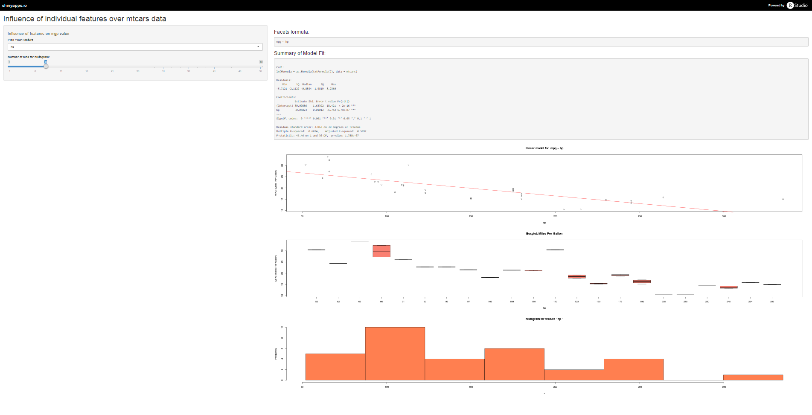

<link rel="stylesheet" href="css/theme/simple.css" id="theme">


## Overview of the mtcars dataset

> The data was extracted from the 1974 Motor Trend US magazine, and comprises fuel consumption and 10 aspects of automobile design and performance for 32 automobiles (1973-74 models). The dataset is composed by 32 observations x 11 variables

| Index | Field | Description                              |
------- | ----- | ------                                   |
| [, 1] | mpg  | Miles/(US) gallon -- Variable of interest |
| [, 2] | cyl  | Number of cylinders                       |
| [, 3] | disp | Displacement (cu.in.)                     |
| [, 4] | hp   | Gross horsepower                          |
| [, 5]	| drat | Rear axle ratio                           |
| [, 6]	| wt   | Weight (lb/1000)                          |
| [, 7]	| qsec | 1/4 mile time                             |
| [, 8]	| vs   | V/S                                       |
| [, 9]	| am   | Transmission (0 = automatic, 1 = manual)  |
| [,10]	| gear | Number of forward gears                   |
| [,11]	| carb | Number of carburetors                     |

--- .class #id 

## Influence of individual features over mpg

### Goal:

This project makes an initial study about the influence of individual features
over the miles per gallon value. The following results are showed for the selected feature:

* Summary of a linear model to explain mpg values
* Graphical view of the regression linear model
* Boxplot to measure the influence of each level of the selected feature over the mpg
* Histogram (with the number of means selected for the user)

### Dimmensions of mtcars dataset:

```{r echo=FALSE}
dim(mtcars)
```

--- .class #id 

## Influence of individual features over mpg

### Shiny App

Available at: https://mgestal.shinyapps.io/project


<!-- Limit image width and height -->
<style type='text/css'>
img {
    max-height: 500px;
    max-width: 800px;
}
</style>

<!-- Center image on slide -->
<script src="http://ajax.aspnetcdn.com/ajax/jQuery/jquery-1.7.min.js"></script>
<script type='text/javascript'>
$(function() {
    $("p:has(img)").addClass('centered');
});
</script>



--- .class #id 


## HowTo generate this documentacion

Next commands will generate the documentation within a RStudio environment

* install.packages("devtools")
* library(devtools)

* install_github('ramnathv/slidify', ref = github_pull(425))
* install_github('ramnathv/slidifyLibraries')

* library(slidify)

If you want compile a slidify project (index.Rmd is the main file):

* slidify("index.Rmd")
* browse("index.html")

